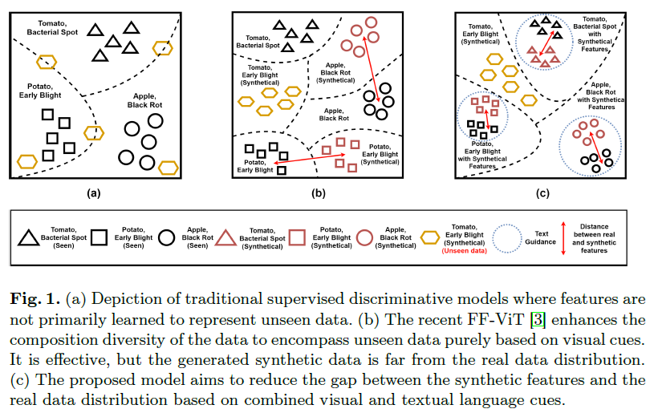
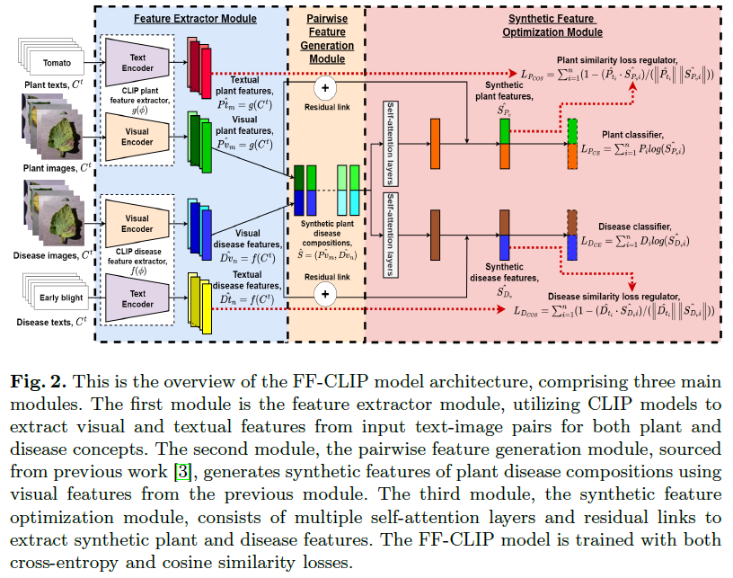

# Can Language Improve Visual Features For Distinguishing Unseen Plant Diseases?

## Abstract
This paper is accepted on International Conference on Pattern Recognition 2024 [[Link]](https://link.springer.com/book/10.1007/978-3-031-78113-1)

[[Paper]](https://link.springer.com/chapter/10.1007/978-3-031-78113-1_20)

Deep learning approaches have been pivotal in identifying multi-plant diseases, yet they often struggle with unseen data. The challenge of handling unseen data is significant due to the impracticality of collecting all disease samples for every plant species. This is attributed to the vast number of potential combinations between plant species and diseases, making capturing all such combinations in the field difficult. Recent approaches aim to tackle this issue by leveraging a zero-shot compositional setting. This involves extracting visual characteristics of plant species and diseases from the seen data in the training dataset and adapting them to unseen data. This paper introduces a novel approach by incorporating textual data to guide the vision model in learning the representation of multiple plants and diseases. To our knowledge, this is the first study to explore the effectiveness of a vision-language model in multi-plant disease identification, considering the fine-grained and challenging nature of disease textures. We experimentally prove that our proposed FF-CLIP model outperforms recent state-of-the-art models by 26.54% and 33.38% in Top-1 accuracy for unseen compositions, setting a solid baseline for zero-shot plant disease identification with the novel vision-language model.

<p align="center">
  
</p>

## Proposed model
Feature Fusion Contrastive Language-Image Pre-training (FF-CLIP) model [[code]](model/FF-CLIP.py)
<p align="center">
  
  <br>
  <i>Proposed FF-CLIP architecture.</i>
</p>

## Results


## Dataset and pretrained weight

* Dataset: PV dataset [[spMohanty Github]](https://github.com/spMohanty/PlantVillage-Dataset/tree/master)  
(You can group all images into single folder to directly use the csv file provided in this repo if you downloaded the original dataset.)

* Pretrained weight: From OpenCLIP

## Implementations
* FF-CLIP model [[code]](model/FF-CLIP.py)

Notes
* The csv file (metadata of images) for FF-CLIP are [here](dataset/csv_ffclip/)

## See also

1. Pairwise Feature Learning for Unseen Plant Disease Recognition [[Paper](https://ieeexplore.ieee.org/abstract/document/10222401/)] 

   The first implementation of FF-ViT model with moving weighted sum. The current work improved and evaluated the performance of FF-ViT model on larger-scale dataset.
  
3. Unveiling Robust Feature Spaces: Image vs. Embedding-Oriented Approaches for Plant Disease Identification [[Paper](https://ieeexplore.ieee.org/abstract/document/10317550/)]

   The analysis between image or embedding feature space for plant disease identifications.

4. PlantAIM: A New Baseline Model Integrating Global Attention and Local Features for Enhanced Plant Disease Identification [[Paper](https://www.sciencedirect.com/science/article/pii/S2772375525000474)] [[Github](https://github.com/abelchai/PlantAIM)]
  
   Plant Disease Global-Local Features Fusion Attention model (PlantAIM) model which combines ViT and CNN components to enhance feature extraction for multi-crop plant disease identification.
   
6. Beyond-supervision-Harnessing-self-supervised-learning-in-unseen-plant-disease-recognition [[Paper](https://www.sciencedirect.com/science/article/pii/S0925231224013791)] [[Github](https://github.com/abelchai/Cross-Learning-Vision-Transformer-CL-ViT)]
 
   Cross Learning Vision Transformer (CL-ViT) model that incorporating self-supervised learning into a supervised model.

7. Can Language Improve Visual Features For Distinguishing Unseen Plant Diseases? [[Paper](https://link.springer.com/chapter/10.1007/978-3-031-78113-1_20)] [[Github](https://github.com/abelchai/FF-CLIP-Can-Language-Improve-Visual-Features-For-Distinguishing-Unseen-Plant-Diseases)]

   FF-CLIP model that incorporate textual data as language cues in guiding visual features to improve the identification of unseen plant diseases.

8. Deep-Plant-Disease Dataset Is All You Need for Plant Disease Identification [[Paper](https://dl.acm.org/doi/abs/10.1145/3746027.3758192)] [[Github](https://github.com/abelchai/Deep-Plant-Disease-Dataset-Is-All-You-Need-for-Plant-Disease-Identification)]

   We curated the largest plant disease dataset with text descriptions known as Deep-Plant-Disease, comprising 248,578 images across 55 crop species, 175 disease classes, and 333 unique crop-disease compositions. We also conducted comprehensive benchmarking across   multiple downstream tasks in plant disease identification under diverse conditions that simulate different real-world challenges.

## Virtual environment dependencies
Python 3.12.9
```
python -m venv py
cd .\py\Scripts
activate
pip install torch==2.6.0 torchvision==0.21.0 torchaudio==2.6.0 --index-url https://download.pytorch.org/whl/cu126
pip install -r requirements_ffclip.txt
```
## License

Creative Commons Attribution-Noncommercial-NoDerivative Works 4.0 International License (“the [CC BY-NC-ND License](https://creativecommons.org/licenses/by-nc-nd/4.0/)”)

## Citation

```bibtex
@inproceedings{liaw2024can,
  title={Can Language Improve Visual Features For Distinguishing Unseen Plant Diseases?},
  author={Liaw, Jerad Zherui and Chai, Abel Yu Hao and Lee, Sue Han and Bonnet, Pierre and Joly, Alexis},
  booktitle={International Conference on Pattern Recognition},
  pages={296--311},
  year={2024},
  organization={Springer}
}
